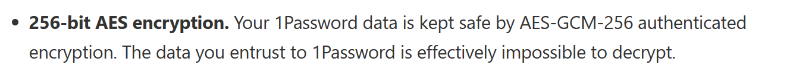
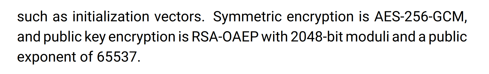
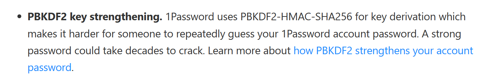
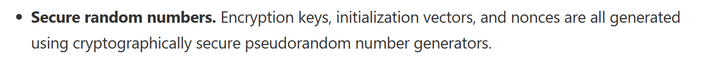
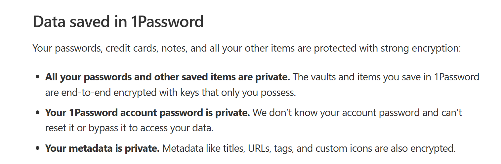
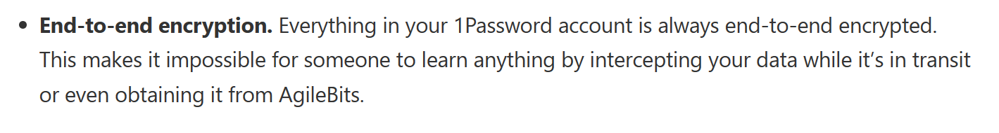
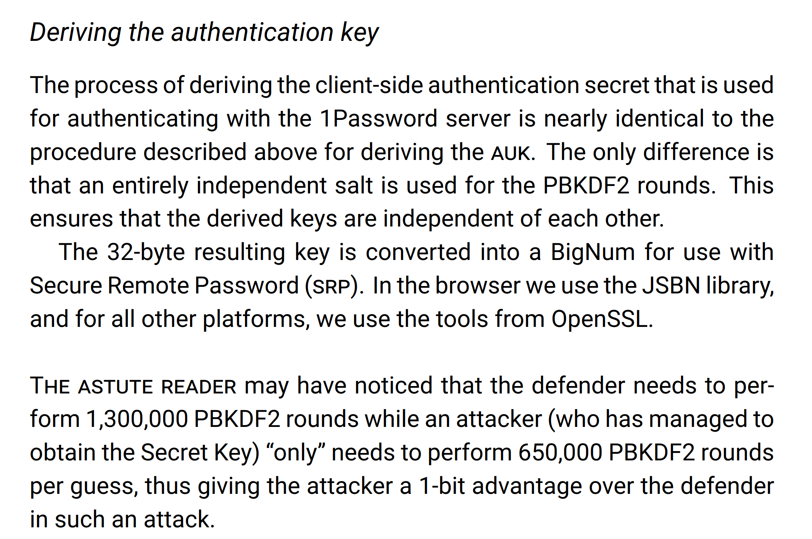
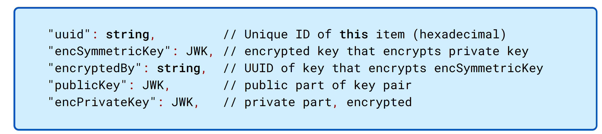
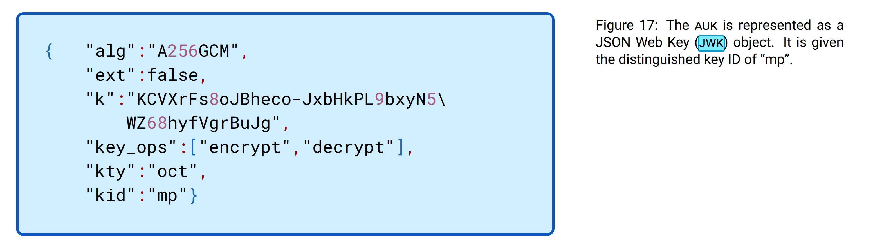

## Cryptographic Algorithm

[About the 1Password security model](https://support.1password.com/1password-security/#encryption)

whitepaper

[About the 1Password security model](https://support.1password.com/1password-security/#encryption)

whitepaper

[About the 1Password security model](https://support.1password.com/1password-security/#encryption)

whitepaper

## Data Field

[About 1Password and your privacy](https://support.1password.com/1password-privacy/)

## Storage Protocol

[About the 1Password security model](https://support.1password.com/1password-security/#encryption)

whitepaper

whitepaper

