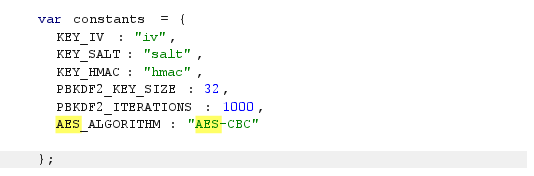
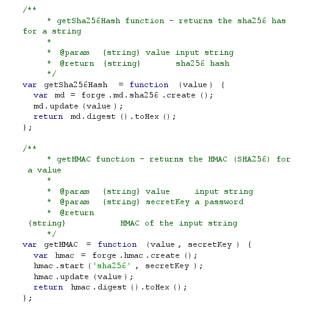
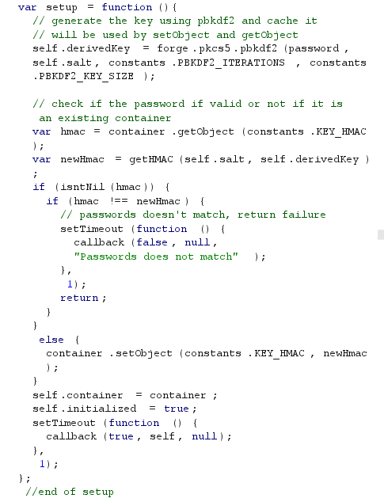
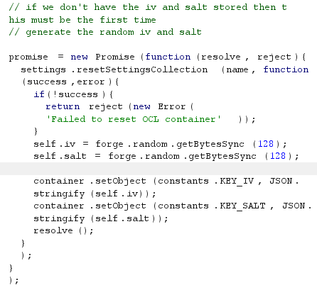
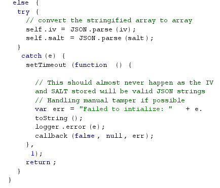
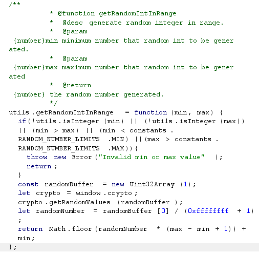

## Static Analysis

SymBfw.js

```javascript
    var constants = {
      KEY_IV : "iv",
      KEY_SALT: "salt",
      KEY_HMAC: "hmac",
      PBKDF2_KEY_SIZE: 32,
      PBKDF2_ITERATIONS: 1000,
      AES_ALGORITHM: "AES-CBC"

    };
```

```javascript
function KeyForPassword(password, salt) {
  var iterations = arguments.length > 2 && arguments[2] !== undefined ? arguments[2] : DEFAULT_ITERATIONS;
  var key = crypto_js_1.default.PBKDF2(crypto_js_1.default.lib.WordArray.create(password), crypto_js_1.default.lib.WordArray.create(salt), {
    keySize: exports.KEY_SIZE,
    iterations: iterations
  });
  return helpers_1.wordsArrayToUint8Array(key);
}
```

Symmetric Encryption



 Hash Function



 Key Derivation Function







Random number gernator




