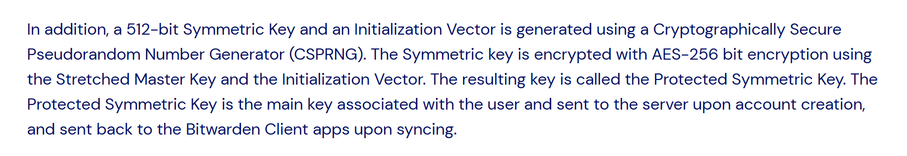

## Cryptographic Algorithm

[Encryption | Bitwarden Help Center](https://bitwarden.com/help/what-encryption-is-used/)

[KDF Algorithms | Bitwarden Help Center](https://bitwarden.com/help/kdf-algorithms/)

[Bitwarden Security Whitepaper | Bitwarden Help Center](https://bitwarden.com/help/bitwarden-security-white-paper/)

## Data Field

[Vault Data | Bitwarden Help Center](https://bitwarden.com/help/vault-data/)

## Storage Protocol

[Bitwarden Security Whitepaper | Bitwarden Help Center](https://bitwarden.com/help/bitwarden-security-white-paper/)

