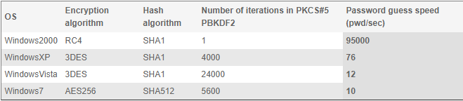
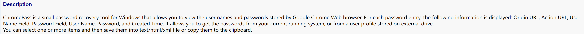

## Cryptographic Algorithm

[Which encryption algorithm does the ProtectData class use?](https://stackoverflow.com/questions/51971447/which-encryption-algorithm-does-the-protectdata-class-use)

## Storage Protocol

[ChromePass](https://www.nirsoft.net/utils/chromepass.html)

There are tools to decrypt the local Chrome password, and the Chrome password manager adopts on-device encryption.
