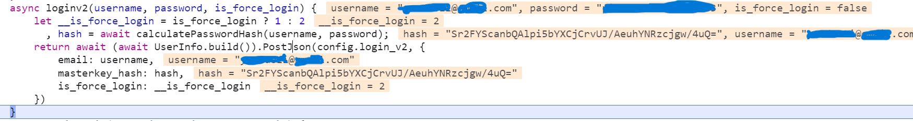

## Dynamic Analysis

When we log in, we find the function that calculates the password hash

```javascript
exports.calculatePasswordHash = async function(uname, pwd) {
            uname || (uname = this.username);
            let Bd_buf = await pbkdf2(fromUtf8(pwd), fromUtf8(uname), 1e5, 256);
            return Bd_buf = await pbkdf2(Bd_buf.arr.buffer, fromUtf8(pwd), 2, 256),
            Bd_buf.b64
        }
```

and send the password hash

```javascript
async loginv2(username, password, is_force_login) {
                let __is_force_login = is_force_login ? 1 : 2
                  , hash = await calculatePasswordHash(username, password);
                return await (await UserInfo.build()).PostJson(config.login_v2, {
                    email: username,
                    masterkey_hash: hash,
                    is_force_login: __is_force_login
                })
            }
```

The email is in plaintext for the server


