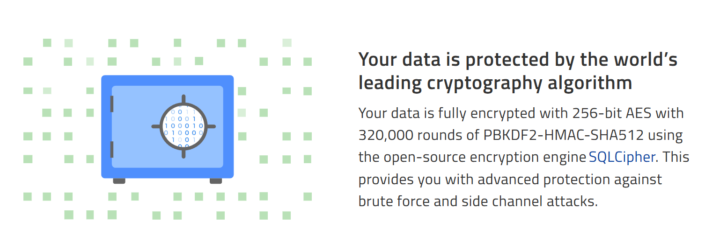
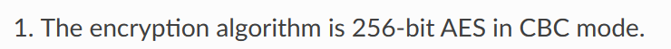
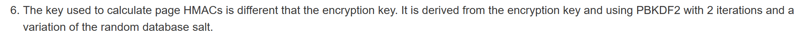
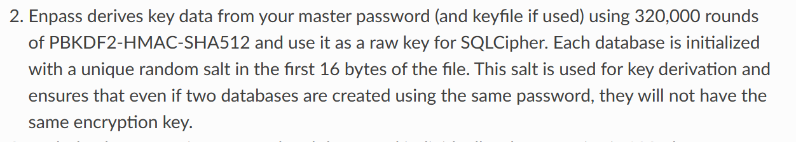
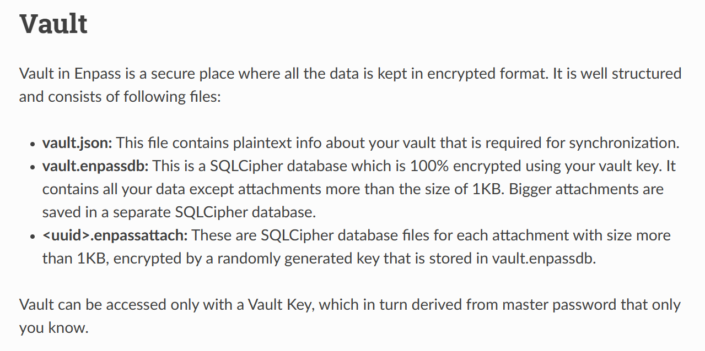
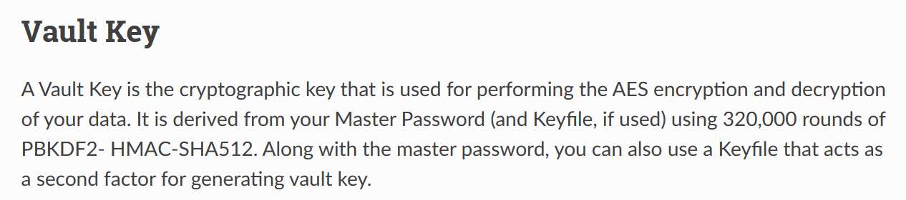

## Cryptographic Algorithm

[Data Security: Safeguard Sensitive Data with Enpass](https://www.enpass.io/security/)

[Vault — Enpass Security Whitepaper documentation](https://support.enpass.io/docs/security-whitepaper-enpass/vault.html)

[Vault — Enpass Security Whitepaper documentation](https://support.enpass.io/docs/security-whitepaper-enpass/vault.html)

## Data Field

[Vault — Enpass Security Whitepaper documentation](https://support.enpass.io/docs/security-whitepaper-enpass/vault.html)

## Storage Protocol

[Vault — Enpass Security Whitepaper documentation](https://support.enpass.io/docs/security-whitepaper-enpass/vault.html)

