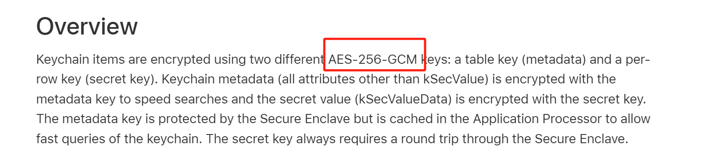
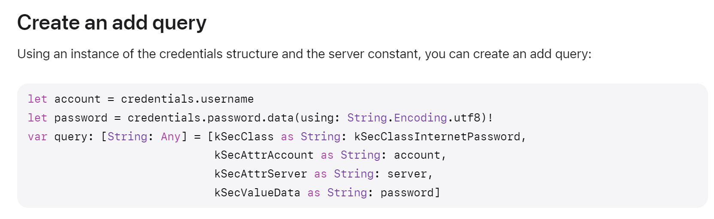
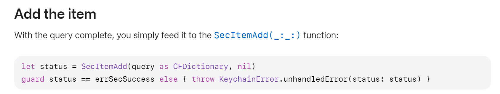
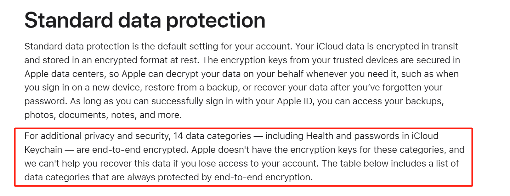
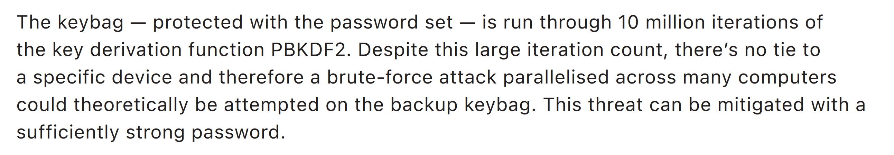

## Cryptographic Algorithm

[Keychain data protection](https://support.apple.com/en-my/guide/security/secb0694df1a/web)

## Data Field

[Adding a password to the keychain](https://developer.apple.com/documentation/security/keychain_services/keychain_items/adding_a_password_to_the_keychain)

[tem attribute keys and values](https://developer.apple.com/documentation/security/keychain_services/keychain_items/item_attribute_keys_and_values)

## Storage Protocol

iCloud KeyChain uses two keys, one for metadata, and one for password.

[iCloud data security overview](https://support.apple.com/en-us/102651)

The server does not have your encryption keys.

whitepaper

