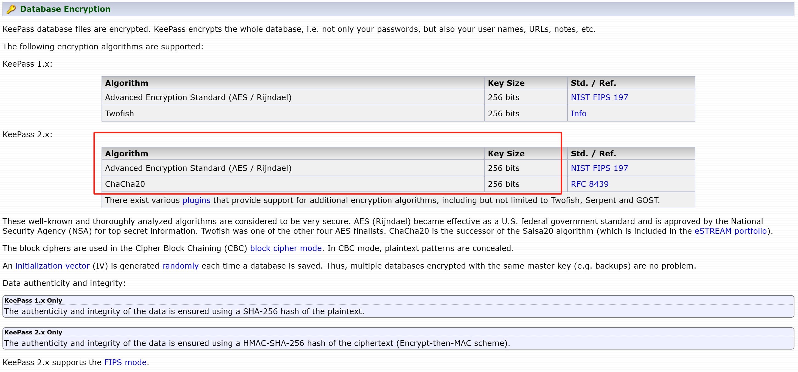
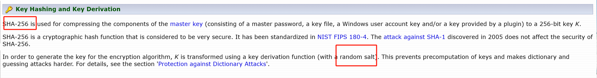
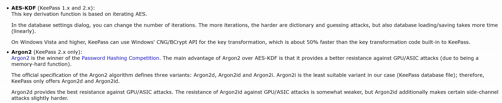
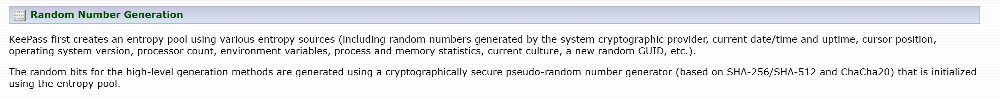
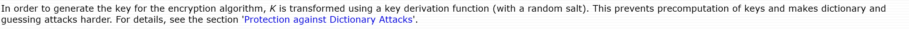

## Cryptographic Primitive

[Security - KeePass](https://keepass.info/help/base/security.html)

[Security - KeePass](https://keepass.info/help/base/security.html)

[Security - KeePass](https://keepass.info/help/base/security.html)

[Security - KeePass](https://keepass.info/help/base/security.html)

## Storage Protocol

