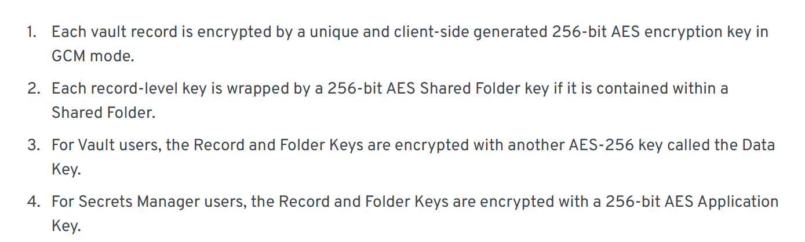
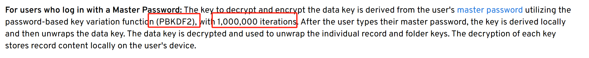
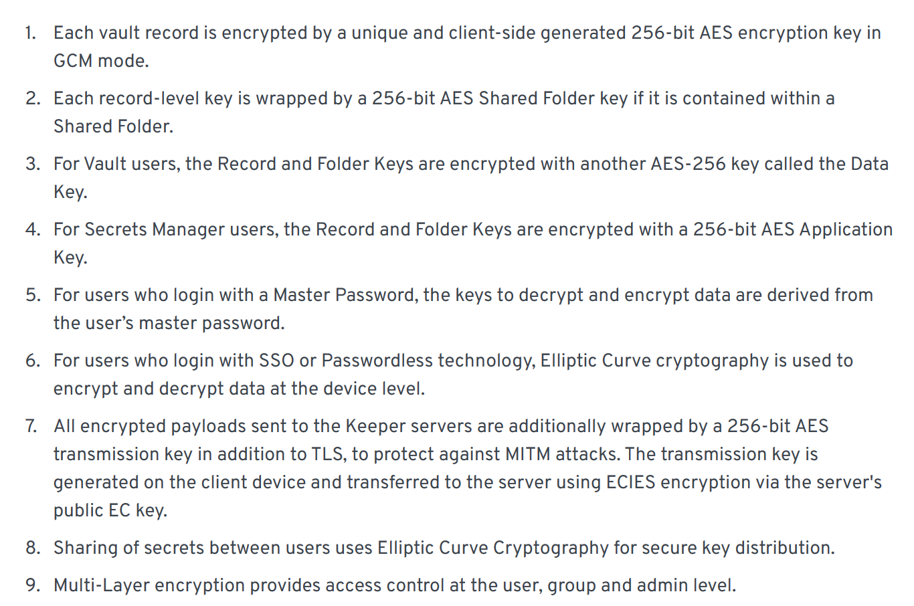
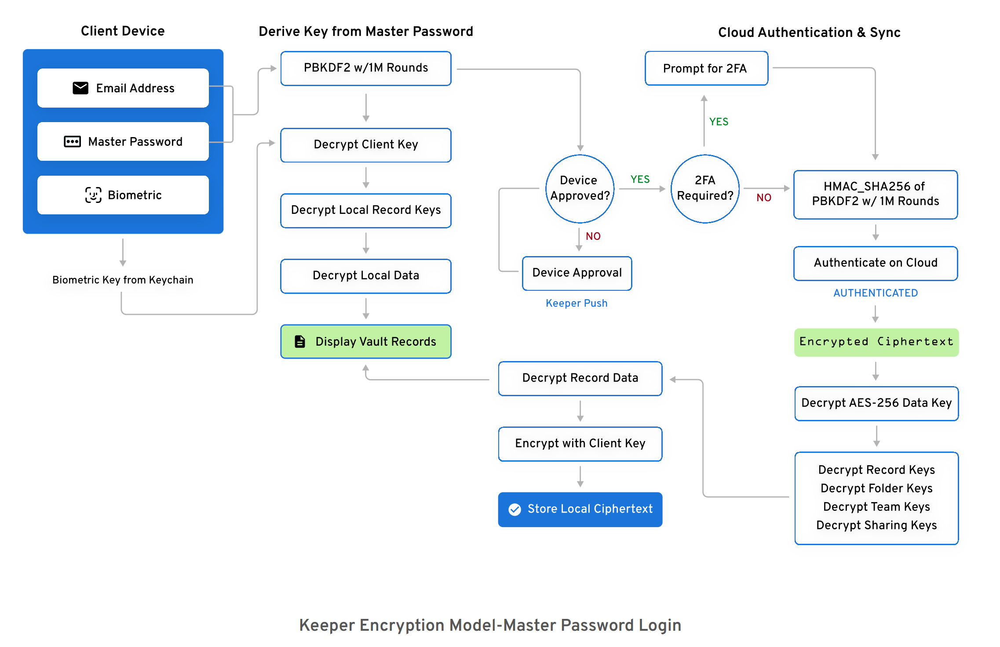
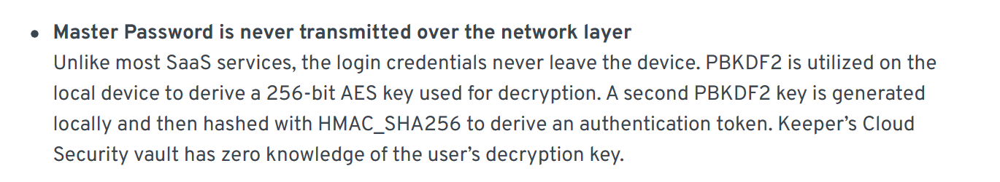
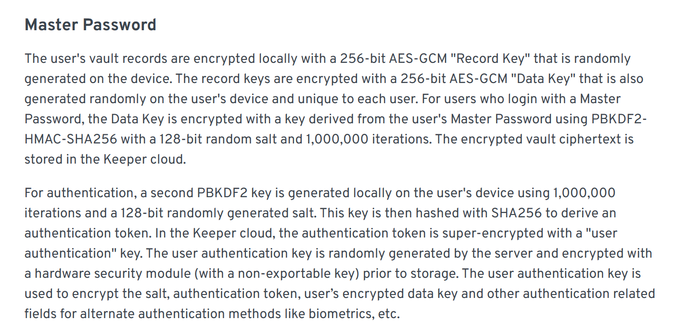

## Cryptographic Primitive

[Keeper Encryption and Security Model Details - Enterprise Guide](https://docs.keeper.io/enterprise-guide/keeper-encryption-model)

## Storage Protocol

[Keeper Encryption and Security Model Details - Enterprise Guide](https://docs.keeper.io/enterprise-guide/keeper-encryption-model)

[Best Password Manager Security & Data Protection | Keeper Security](https://www.keepersecurity.com/security.html)

[Keeper Encryption and Security Model Details - Enterprise Guide](https://docs.keeper.io/enterprise-guide/keeper-encryption-model)

