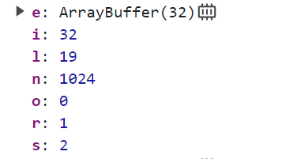

## Dynamic Analysis

When saving the database, we find

```
argon2(e, t, n, s, i, r, o, l) {
                                const c = {
                                    password: e,
                                    salt: t,
                                    memory: n,
                                    iterations: s,
                                    length: i,
                                    parallelism: r,
                                    type: o,
                                    version: l
                                };
                                return this.loadRuntime(n).then((e=>{
                                    const t = a.ts();
                                    return e.hash(c).then((e=>(a.debug("Hash computed", a.ts(t)),
                                    e)))
                                }
                                ))
                            }
```

and the parameter is


