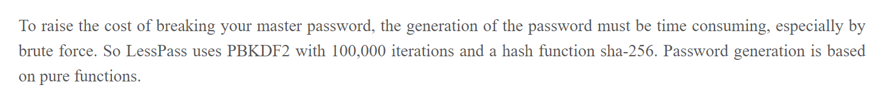
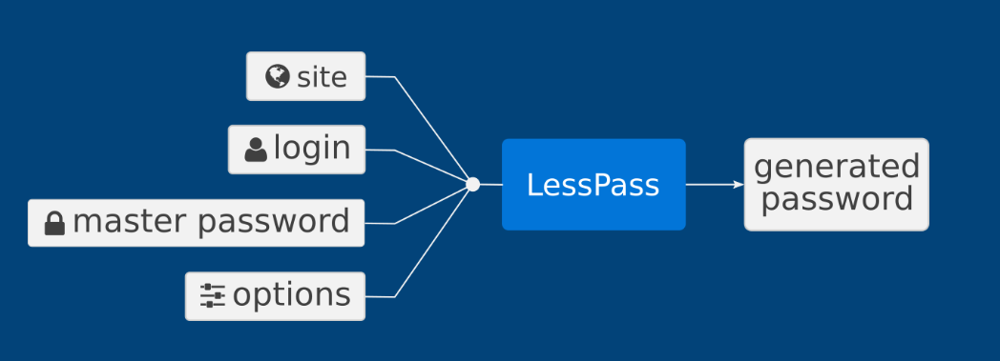
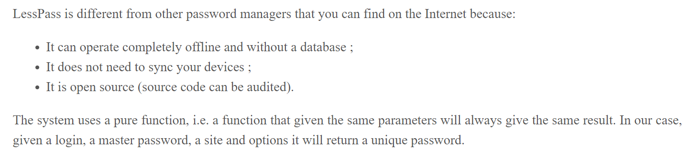

## Cryptographic Algorithm

[LessPass How Does It Work?](https://blog.lesspass.com/2016-10-19/how-does-it-work)

## Data Field

[lesspass](https://www.lesspass.com/#/)

## Storage Protocol

[LessPass How Does It Work?](https://blog.lesspass.com/2016-10-19/how-does-it-work)

