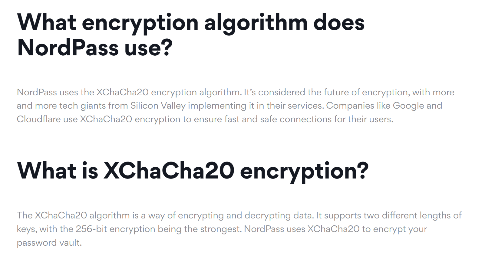
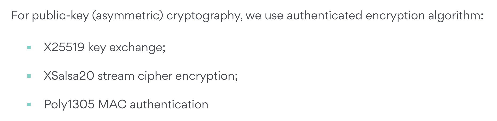
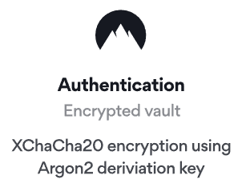
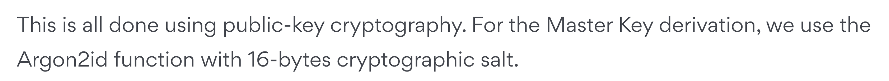
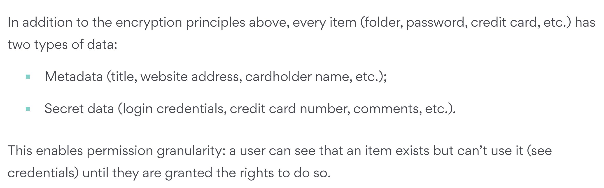
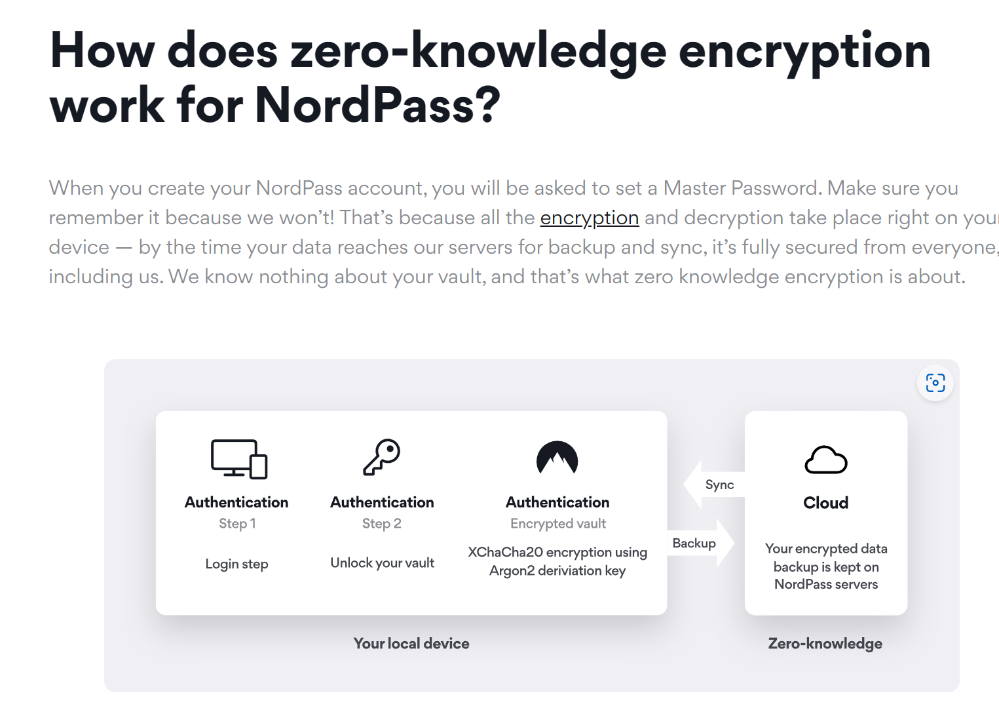
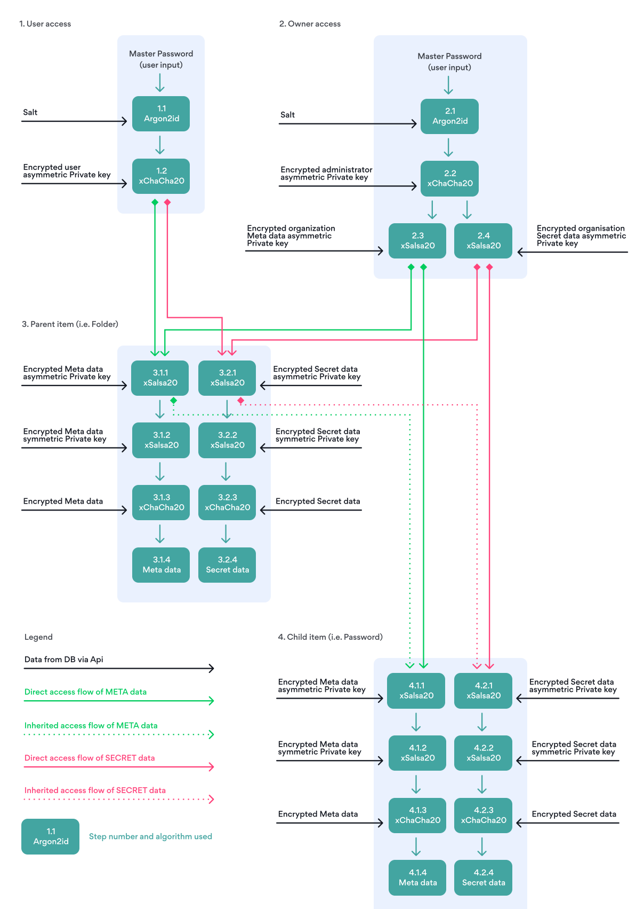

## Cryptographic Primitive

[XChaCha20 encryption | NordPass](https://nordpass.com/features/xchacha20-encryption/)

whitepaper:

[Zero-Knowledge Encryption: Extra Password Safety | NordPass](https://nordpass.com/features/zero-knowledge-architecture/)

whitepaper：

## Data Field

whitepaper:

## Storage Protocol

[Zero-Knowledge Encryption: Extra Password Safety | NordPass](https://nordpass.com/features/zero-knowledge-architecture/)

whitepaper:

