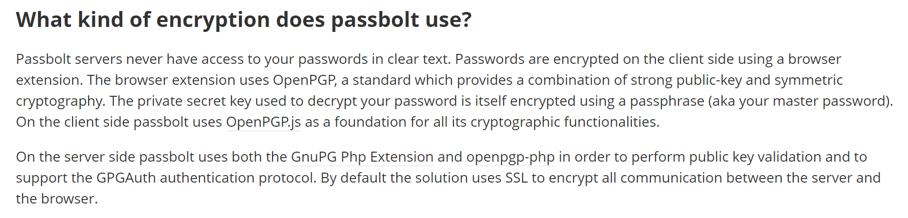
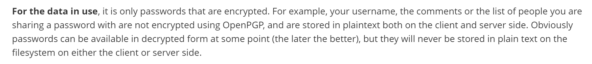
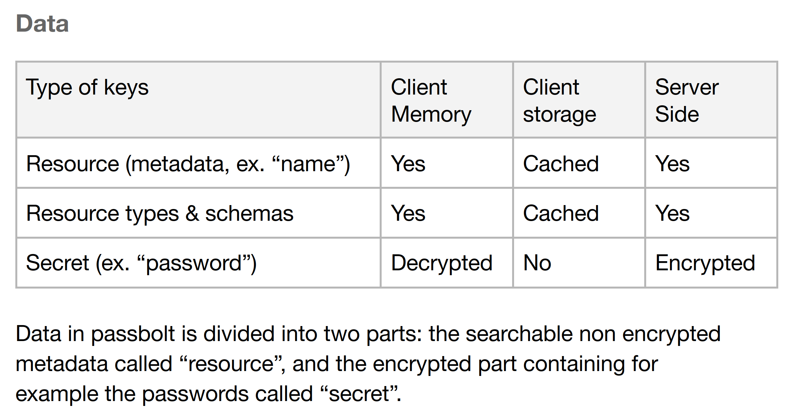
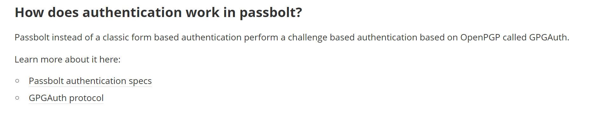

## Cryptographic Algorithm

[What kind of encryption does passbolt use?](https://help.passbolt.com/faq/security/encryption-tech)

## Data Field

[What data is encrypted in passbolt?](https://help.passbolt.com/faq/security/what-is-encrypted)

whitepaper

## Storage Protocol

[How does authentication work in passbolt?](https://help.passbolt.com/faq/security/authentication)

[Authentication in passbolt](https://help.passbolt.com/tech/auth)

whitepaper

