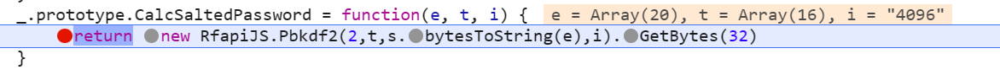
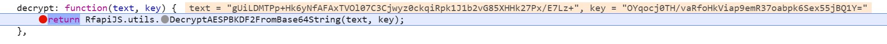
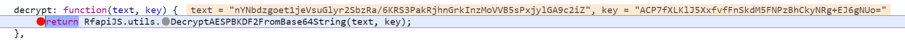

## Dynamic Analysis

When logging in, we find the function

```javascript
var processLogin = function(otp_password, otp_memorize, otp_channel, otp_new) {
        if (processStarted) {
            return;
        }
        $('.result-error').html('').hide();
        sessionStorage.removeItem('UserID');
        var sUser = $("#username").val().trim();
        var sPwd = $("#password").val();
        var timeout = $('select[name=rf_timeout]').val();
        var tieIP = $('input[name=tie_ip]').prop('checked') ? 1 : 0;
        var additionalDesc = $('input[name=_rf_computerdescr_]').val();
        if (
            sUser.length < RFO.ACCOUNT_LOGIN_MIN ||
            Utils.countChars(sUser) > Utils.maxCharsLength(sUser, RFO.ACCOUNT_LOGIN_MAX) ||
            (sUser.indexOf('@') === -1 && sUser.match(/[^a-zA-Z_\-\d]/)) ||
            (sUser.indexOf('@') !== -1 && !Utils.isValidEmail(sUser))
        ) {
            Utils.indicateError($("#username"));
            return;
        }
        if (sPwd === '') {
            Utils.indicateError($("#password"));
            return;
        }
        if (typeof (otp_password) !== 'undefined' && otp_password === '') {
            Utils.indicateError($("#otp-password"));
            return;
        }
        if (sUser === sPwd) {
            alert(_STR.NOTE_LOGIN_EQUAL_PASSWORD);
        }
        if (enrollNewDevice !== null) {
            $('#otp-memorize').parent().hide();
            otp_memorize = enrollNewDevice == 1 ? 1 : 0;
        }
        processStart();
        RFMgr.SetUserID(sUser);
        RFMgr.setAccountPwd(sPwd);
        RFMgr.LoginToAccount_Scram(sUser, sPwd, timeout, otp_password, otp_memorize, otp_channel,
            //  ************  OK (AnswerCallBack) ************
            function (httpStatusCode, accInfo) {
                sessionStorage.UserID = sUser;
                processAuth(accInfo.accountId, sPwd, timeout, tieIP, false, false, accInfo);
            },
            //  ***********  ERROR (ErrorCallBack) ***********
            function (errObject) {
                processStop();
                var errorMessage = '';

                var showOTPForm = function() {
                    var successText = '';
                    if (typeof (otp_new) !== 'undefined') {
                        successText = _STR.TEXT_OTP_SEND_NEW_SUCCESS;
                        $('#otp-new').trigger('hideTemporary');
                    } else if (typeof (otp_password) !== 'undefined') {
                        // OTP expired, so is sent the new OTP
                        successText = _STR.TEXT_OTP_SEND_NEW_SUCCESS_EXPIRED;
                        $('#otp-password').val('').trigger('focus');
                    } else {
                        switch (otpChannel) {
                            case 'email':
                                successText = _STR.TEXT_OTP_SEND_BY_EMAIL_SUCCESS;
                                $('#otp-new').trigger('hideTemporary');
                                break;
                            case 'sms':
                                successText = _STR.TEXT_OTP_SEND_BY_SMS_SUCCESS;
                                $('#otp-new').trigger('hideTemporary');
                                break;
                            case 'phone':
                                successText = _STR.TEXT_OTP_SEND_BY_PHONE_SUCCESS;
                                $('#otp-new').trigger('hideTemporary');
                                break;
                            case 'totp':
                                successText = _STR.TEXT_OTP_SEND_BY_TOTP_SUCCESS;
                                break;
                        }
                    }
                    $('.js_hide_on_otp').hide();
                    $('#channel-block').hide();
                    $('#otp-memorize').prop('checked', true);
                    $('#auth').find('.b-form h3').text(_STR.TITLE_RFO_LOGIN);
                    $('#otp-block').show().find('.result-success').html(successText);
                    currentOTPChannel = otpChannel;
                };

                // invalid credentials
                if (errObject.Code && errObject.Code === 401) {
                    if (typeof (otp_password) !== 'undefined') {
                        errorMessage = _STR.ERR_WRONG_OTP_PASSWORD;
                    } else {
                        errorMessage = urlParts.authReturnUrl === 'idp_login' ? _STR.ERR_WRONG_MASTER_PASSWORD : _STR.RFJS_TEXT_LOGINFORM_INVALID;
                        $("#password").val('').trigger('focus');
                    }
                // otp sent or ignore 'retry after' error
                } else if (errObject.Code && (errObject.Code === 410 || errObject.Code === 503 && errObject.HttpRequest.getResponseHeader('retry-after') && typeof (otp_new) === 'undefined')) {
                    otpChannel = errObject.HttpRequest.getResponseHeader('x-sib-auth-alt-otp') || otp_channel;
                    if (otp_channel === '-') {
                        var bIgnoreOTPAuth = otpChannel !== otp_channel && Utils.in_array(urlParts.authReturnUrl, [
                            'pums_rf',
                            'pums_rf_code',
                            'pums_rf_family',
                            'pums_rf_family_upgrade',
                            'pums_rf_uhcff'
                        ]);
                        if (bIgnoreOTPAuth) {
                            // allow to login without OTP
                            processAuth(sUser, sPwd, timeout, tieIP);
                        } else {
                            // this header is present in response headers only when (otp_channel === '-'), so save the value for future use
                            enrollNewDevice = errObject.HttpRequest.getResponseHeader('x-sib-auth-alt-memorize');
                            processLogin(undefined, undefined, otpChannel);
                        }
                        return;
                    } else {
                        showOTPForm();
                    }
                // otp select channel
                } else if (errObject.Code && errObject.Code === 411) {
                    var aChannels = [];
                    var sOTPChannels = errObject.HttpRequest.getResponseHeader('x-sib-auth-alt-channel');
                    if (sOTPChannels) {
                        aChannels = sOTPChannels.split(' ');
                    }
                    // show only available channels
                    var firstChecked = false;
                    $('#channel-block').find('div.radio').each(function(){
                        var $this = $(this);
                        var value = $this.find('input').val();
                        if (Utils.in_array(value, aChannels)) {
                            if (!firstChecked) {
                                $this.find('input[type=radio]').prop('checked', true);
                                firstChecked = true;
                            }
                            $this.show();
                        } else {
                            $this.hide();
                        }
                    });
                    $('#login-block, #otp-block, .use-idp-auth, .b-create-new').hide();
                    $('#auth').find('.b-form h3').text(_STR.TITLE_RFO_LOGIN);
                    $('#channel-block').show();
                // retry-after error
                } else if (errObject.Code && errObject.Code === 503 && errObject.HttpRequest.getResponseHeader('retry-after')) {
                    if (typeof (otp_channel) !== 'undefined') {
                        errorMessage = _STR.TEXT_OTP_SEND_NEW_ERROR;
                    } else {
                        errorMessage = _STR.ERR_FREQUENT_LOGIN;
                    }
                // account disabled
                } else if (errObject.Code && errObject.Code === 403) {
                    var errReason = errObject.HttpRequest.getResponseHeader("x-sib-reason");
                    if (errReason && errReason === 'disabled-account') {
                        errorMessage = Utils.xReplace(_STR.ERR_DISABLED_ACCOUNT, 'href=\"'+RFO.SUPPORT_URL+'\"');
                    } else if (errReason && errReason === 'redirect') {
                        var redirectLocation = errObject.HttpRequest.getResponseHeader("Location");
                        var urlStringParts = location.toString().split('#');
                        urlStringParts[0] = (urlStringParts[0].replace(/&?(\??)UserID=[^&]*/, '$1') + (location.search ? '&' : '?') + 'UserID=' + sUser).replace('?&', '?');
                        var serverID = Utils.detectServerID(redirectLocation);
                        showResultMsg(
                            serverID ? Utils.xReplace(_STR.ERR_REDIRECT_TO_ANOTHER_SERVER, serverID) : _STR.ERR_REDIRECT_TO_ANOTHER_SERVER1,
                            false, // green dialog
                            redirectLocation + urlStringParts.join('#').substring((location.protocol + '//' + location.host).length),
                            false,
                            false,
                            _STR.CL_NOTIFICATION,
                            _STR.BUTTON_CONTINUE
                        );
                    } else if (errReason && errReason === 'need-idp-auth') {
                        var idpId = errObject.HttpRequest.getResponseHeader('x-sib-idp');
                        if (idpId) {
                            document.location.href = idpLoginUrl(idpId);
                        } else {
                            errorMessage = Utils.stripTags(errObject.Description);
                        }
                    } else {
                        errorMessage = Utils.stripTags(errObject.Description);
                    }
                // cannot send OTP
                } else if (typeof (otp_channel) !== 'undefined' && otp_channel !== '-') {
                    if (otp_channel==="email") {
                        var responseText = Utils.stripTags(errObject.HttpRequest.responseText);
                        if (errObject.Code === 500 && responseText.match(/421|450|451/)) {
                            showOTPForm();
                            errorMessage = "<b>"+_STR.TEXT_CONFIRM_CODE_SEND_LATER+"</b><br>"+responseText;
                        } else {
                            // display the SMTP error returned from server
                            errorMessage = responseText;
                        }
                    } else {
                        errorMessage = _STR.ERR_CANNOT_SEND_OTP;
                    }
                // other errors
                } else {
                    errorMessage = Utils.getErrorDescription(errObject);
                }
                if (errorMessage !== '') {
                    $('.result-error').html(errorMessage).show();
                }
            },
            additionalDesc
        );
    };
```

```javascript
en.prototype[D] = function(n, i, a, o, s, f, u, _, p) {
        var l = "RfDataManager." + D;
        try {
            var S = this;
            c.FUNC_INOUT;
            var U = !1;
            if (window.XMLHttpRequest ? U = new XMLHttpRequest : window.ActiveXObject && (U = new ActiveXObject("Microsoft.XMLHTTP")),
            !S.misc_checkParameters({
                SERVER_URL: S.m_sServerUrl,
                USER_ID: n,
                USER_PWD: i
            }, _))
                return c.SPECIAL_CASE,
                !1;
            var I = S.internal_CreateHeaders();
            if (I["x-sib-session-timeout"] = a,
            typeof o != d && (I["x-sib-auth-alt-otp"] = o),
            typeof s != d && (I["x-sib-auth-alt-memorize"] = s),
            typeof f != d && (I["x-sib-auth-alt-channel"] = f),
            typeof p != d && "" != p) {
                var h = r.stringToBytes(p)
                  , y = t.bytesToBase64(h);
                I["x-sib-auth-computerdescr"] = y
            }
            typeof o == d && typeof s == d && typeof f == d && (I["x-sib-auth-alt-channel"] = "-");
            var v = new RfapiJS.SibHttpScramAuthClient;
            v.SetRealm("RoboForm Online Server");
            var N = v.GetAuthRequestHeader(n, i);
            I.Authorization = N;
            var O = S.m_sServerUrl + "/rf-api/?login2"
              , E = {
                email: n,
                type: g
            }
              , R = JSON.stringify(E);
            return S.makeRequestAsync(O, R, I, "POST", !1, !1, (function(e) {
                if (c.FUNC_INOUT,
                e.status != sr)
                    C(O, e, R);
                else {
                    var t = S.m_sServerUrl + "/rf-api/" + encodeURI(n) + "?login";
                    S.makeRequestAsync(t, null, I, "POST", !1, !1, (function(e) {
                        C(t, e, null)
                    }
                    ), U)
                }
            }
            ), U),
            c.FUNC_INOUT,
            !0;
            function C(e, t, r) {
                if (t.status,
                c.FUNC_INOUT,
                t.status != ar) {
                    if (t.status == nr) {
                        if (c.INFO,
                        typeof u != d) {
                            var a = JSON.parse(t.responseText);
                            u(nr, a)
                        }
                        return !0
                    }
                    if (typeof _ != d)
                        return _(new $r(t.status,t.statusText,void 0,t,void 0)),
                        !1
                } else {
                    var o = t.getResponseHeader("WWW-Authenticate");
                    if (o) {
                        var s = RfapiJS.SibHttpGetAuthMethod(o);
                        v.ParseServerResponse(s) && (N = v.GetAuthRequestHeader(n, i),
                        I.Authorization = N,
                        S.makeRequestAsync(e, r, I, "POST", !1, !1, (function(e, t) {
                            if (c.FUNC_INOUT,
                            !S.misc_checkHttpResponse(e, t, _))
                                return c.SPECIAL_CASE,
                                !1;
                            if (e.status == nr) {
                                c.INFO;
                                var r = JSON.parse(e.responseText);
                                return r.disabled ? (typeof u != d && u(nr, r),
                                c.SPECIAL_CASE,
                                !1) : (S[Zt](),
                                S[qt](n),
                                S[Bt](i),
                                S[Kt](i),
                                typeof u != d && u(nr, r),
                                !0)
                            }
                            if (typeof _ != d)
                                return _(new $r(e.status,e.statusText,void 0,e,void 0)),
                                !1;
                            c.FUNC_INOUT
                        }
                        ), U))
                    }
                }
            }
        } catch (e) {
            this.internal_catchedException(l, e, _)
        }
    }
```

```javascript
a.prototype.GetAuthRequestHeader = function(a, _) {
        var n = "";
        switch (this.m_ctx.GetState()) {
        case i.enServerFirstMessageRecieved:
            var h = this.m_ctx.MakeClientFinalMessage();
            n = "SibAuth ",
            this.m_sid && (n += 'sid="' + this.m_sid + '",');
            var m = s.stringToBytes(h);
            n += 'data="' + (l = t.bytesToBase64(m)) + '"';
            break;
        case i.enClientFinalMessageSent:
        case i.enServerFinalMessageRecieved:
        case i.enServerVerified:
            var o = this.GenerateNonce(this.s_nonceLength);
            h = this.m_ctx.MakeClientNextMessage(o);
            n = "SibAuth ";
            break;
        default:
            o = this.GenerateNonce(this.s_nonceLength);
            e.INFO;
            var c = s.stringToBytes(_)
              , l = (h = this.m_ctx.MakeClientFirstMessage(a, c, r.enSHA256, o),
            m = s.stringToBytes(h),
            t.bytesToBase64(m));
            n = 'SibAuth realm="' + this.m_realm + '",data="' + l + '"'
        }
        return n
    }
```

```javascript
_.prototype.MakeClientFirstMessage = function(t, s, r, a) {
        return this.Empty(),
        s == this.m_cached_password && r == this.m_hashAlgorithm || this.EmptyCache(),
        this.SetHashAlgorithm(r),
        this.m_user_name = t,
        this.m_password = s,
        this.m_client_nonce = this.MakeNonceValid(a),
        this.m_client_nonce,
        e.INFO,
        this.m_client_first_message_bare = "n=" + encodeURI(this.m_user_name) + ",r=" + this.m_client_nonce,
        this.m_client_first_message = "n,," + this.m_client_first_message_bare,
        this.m_state = i.enClientFirstMessageSent,
        this.m_client_first_message
    }
```

```javascript
_.prototype.CalcSaltedPassword = function(e, t, i) {
        return new RfapiJS.Pbkdf2(2,t,s.bytesToString(e),i).GetBytes(32)
    }
```



Encrypt/Decrypt

```javascript
DecryptAESPBKDF2FromBase64String: function(a, e) {
            var o = RfapiJS.utils.base64ToBytes(a)
              , i = new Array(16);
            RfapiJS.utils.BlockCopy(o, 0, i, 0, i.length);
            var t = new Array(o.length - i.length);
            RfapiJS.utils.BlockCopy(o, i.length, t, 0, o.length - i.length);
            var r = new RfapiJS.Pbkdf2(2,i,e,100)
              , s = new Array(64);
            s = r.GetBytes(64);
            e = new Array(32);
            var n = new Array(16);
            RfapiJS.utils.BlockCopy(s, 0, e, 0, 32),
            RfapiJS.utils.BlockCopy(s, 32, n, 0, 16);
            var u = CryptoJS.enc.Hex.parse(RfapiJS.utils.bytesToHex(e))
              , l = CryptoJS.enc.Hex.parse(RfapiJS.utils.bytesToHex(n))
              , m = {};
            m.iv = l,
            m.mode = CryptoJS.mode.CBC,
            m.padding = CryptoJS.pad.Pkcs7;
            var c = CryptoJS.algo.AES.createDecryptor(u, m)
              , d = CryptoJS.enc.u8array.parse(t)
              , g = c.process(d)
              , h = c.finalize();
            return h.sigBytes >= 0 && (g = g.concat(h)),
            g.toString(CryptoJS.enc.Utf8)
        }
```

```javascript
var filePreview = function(fileData, index, password) {
        var icon = Utils.getFileIconName(fileData.type);
        $('#namePlace ._icon').html('');
        $('#namePlace ._text').text(fileName).attr('title', fileName);
        $('#preview .preview_place').hide();
        $('#preview #waitPreview').show();
        $('#preview').modal('show');

        var passwd = '';
        if (typeof password !== 'undefined') {
            passwd = password;
        } else if (Utils.Storage.get('passwd')) {
            passwd = Utils.decrypt(Utils.Storage.get('passwd'), RFO.MPKEY);
        }

        RFMgr.GetDataItem(fileData.fullName, fileData.type,
            //  ************  OK (AnswerCallBack) ************
            function (rf_object) {
                // save master password if needed
                if (typeof password !== 'undefined') {
                    if ($('#rf_savepasscheck').prop('checked')) {
                        Utils.Storage.set('passwd', Utils.encrypt(passwd, RFO.MPKEY));
                    } else {
                        console.log("Remove passwd: #1");
                        Utils.Storage.remove('passwd');
                    }
                }

                $('#preview .preview_place').hide();
                $('#preview #'+index+'Preview').show();
                $('#preview #'+index+'Preview .field').remove();

                switch(index) {
                    case 'logins':
                        // process GoToURL
                        if (typeof rf_object[prop.GOTOURL] === 'undefined' || rf_object[prop.GOTOURL] === '') {
                            $('#gotoURLPlace').hide();
                        } else {
                            var strURLNotAllowedError = '';
                            $('#gotoURLPlace').show().find('input').val(rf_object[prop.GOTOURL]);

                            // check whitelist/blacklist policy
                            if (RFO.POLICIES && RFO.POLICIES.CONFIG && (RFO.POLICIES.CONFIG.WhiteListURLs || RFO.POLICIES.CONFIG.BlackListURLs)) {
                                var checkedURL = rf_object[prop.GOTOURL].toLowerCase();
                                var whitelist = RFO.POLICIES.CONFIG.WhiteListURLs ? RFO.POLICIES.CONFIG.WhiteListURLs.split('\\n') : [];
                                var blacklist = RFO.POLICIES.CONFIG.BlackListURLs ? RFO.POLICIES.CONFIG.BlackListURLs.split('\\n') : [];
                                if (!Utils.checkBlackWhiteListPolicies(blacklist, whitelist, checkedURL)) {
                                    strURLNotAllowedError = _STR.CL_POLICIES_MSG_CANNOT_USE_PASSCARD;
                                }
                            }
                            // check for unsafe URL
                            if (rf_object[prop.GOTOURL].replace(/\s/g, '').match(/^javascript/)) {
                                strURLNotAllowedError = _STR.ERR_UNSAFE_URL;
                            }
                            if (strURLNotAllowedError) {
                                $('#gotoURLPlace ._gotoURL').addClass('disabled').closest('.input-group-btn').popover({trigger: 'hover', placement: 'left', content: strURLNotAllowedError});
                            } else {
                                $('#gotoURLPlace ._gotoURL').attr('href', rf_object[prop.GOTOURL]).removeClass('disabled').closest('.input-group-btn').popover('destroy');
                            }
                        }
                        // process other fields
                        if (rf_object[prop.FIELDS]) {
                            for (var i = 0; i < rf_object[prop.FIELDS].length; i++) {
                                var field = rf_object[prop.FIELDS][i],
                                    type = parseInt(field[prop.TYPE], 10),
                                    name = field[prop.NAME],
                                    value = field[prop.VALUE];
                                if (!Utils.in_array(name, ['Note$', '$Note$'])) {
                                    var $cloned = $('#'+index+'FieldTemplate').clone();
                                    $cloned.find("._name").attr('title', name).find('span').text(name);
                                    $cloned.find("._value").val(value);
                                    if (type === 2 || (type === 0 && name === 'Password$')) {
                                        $cloned.find("._value").addClass('_password');
                                    } else {
                                        $cloned.find('.input-group-btn').remove();
                                        $cloned.find('.fvalue').removeClass('input-group');
                                    }
                                    $cloned.removeAttr('id').addClass('field').appendTo($('#'+index+'FieldPlace'));
                                }
                            }
                        }
                        // process Note
                        $('#passcardNotePlace').hide();
                        if (rf_object[prop.NOTE]) {
                            var noteText = Utils.escapeHtml(rf_object[prop.NOTE]);
                            $('#passcardNotePlace div pre').remove();
                            $('#passcardNotePlace div').html('<pre>'+noteText+'</pre>');
                            $('#passcardNotePlace').show();
                            $('#passcardNotePlace div').css('height','');
                            if($('#passcardNotePlace div').height()>$('#passcardNotePlace div :first-child')[0].scrollHeight+$('#passcardNotePlace div')[0].offsetHeight-$('#passcardNotePlace div')[0].clientHeight) {
                                $('#passcardNotePlace div').height($('#passcardNotePlace div :first-child')[0].scrollHeight+$('#passcardNotePlace div')[0].offsetHeight-$('#passcardNotePlace div')[0].clientHeight);
                            }
                        }
                        // process show/hide password fields
                        var showHidePass = function(bToggle){
                            var el_type, el, parent, bHidePass = (Utils.Storage.get('hide_pass') !== 'false');
                            if (bToggle) {
                                bHidePass = !bHidePass;
                            }
                            if (bHidePass) {
                                el_type = 'password';
                            } else {
                                el_type = 'text';
                            }
                            $('#loginsPreview ._password').each(function(){
                                el = document.createElement('input');
                                el.className = this.className;
                                el.value = this.value;
                                el.id = this.id;
                                el.readOnly = this.readOnly;
                                el.type = el_type;
                                parent = this.parentNode;
                                parent.removeChild(this);
                                $(parent).prepend(el).find('.btnShowPass').off('click').on('click', function(){
                                    showHidePass(true);
                                }).off('focus').on('focus', function(){
                                    $(this).blur();
                                });
                                if (bHidePass) {
                                    $(parent).find('.rfoicon').removeClass('rfoicon-add-to-favorites').addClass('rfoicon-remove-from-favorites');
                                } else {
                                    $(parent).find('.rfoicon').removeClass('rfoicon-remove-from-favorites').addClass('rfoicon-add-to-favorites');
                                }
                            });
                            if (bToggle) {
                                Utils.Storage.set('hide_pass', bHidePass);
                            }
                        };
                        // check ShowPasswordsAsStarsInEditor policy
                        if (RFO.POLICIES && RFO.POLICIES.CONFIG && RFO.POLICIES.CONFIG.ShowPasswordsAsStarsInEditor === '1') {
                            $('.btnShowPass').hide().closest('.input-group').removeClass('input-group');
                            Utils.Storage.remove('hide_pass');
                        }
                        showHidePass();
                        break;
                    case 'identities':
                        var addFields = function(field) {
                            var bNote = ~field[prop.NAME].lastIndexOf("Note_-SpecialField-");
                            var $cloned = (bNote) ? $('#'+index+'FieldTemplateNote').clone() : $('#'+index+'FieldTemplate').clone();
                            $cloned.find('._name').attr('title', field[prop.NAME]).find('span').text(field[prop.NAME]);
                            $cloned.find('._value').each(function(){
                                $(this).val(field[prop.VALUE]);
                                if (bNote) {
                                    $(this).attr('rows', field[prop.VALUE].split("\n").length);
                                }
                            });
                            $cloned.removeAttr('id').addClass('field').appendTo($('#'+index+'FieldPlace'));
                        };
                        if (!rf_object[prop.GROUPS]) {
                            break;
                        }
                        for (var i = 0; i < rf_object[prop.GROUPS].length; i++) {
                            var group = rf_object[prop.GROUPS][i];
                            if (group[prop.INSTANCES]) {
                                for (var j = 0; j < group[prop.INSTANCES].length; j++) {
                                    var k;
                                    var instance = group[prop.INSTANCES][j];
                                    var $clonedGroup = $('#'+index+'GroupTemplate').clone().removeAttr('id').addClass('field').appendTo($('#'+index+'FieldPlace'));
                                    if (group[prop.NAME] === 'Custom') {
                                        $clonedGroup.find('span').html("<b>= Custom Fields =</b>");
                                        for (k = 0; k < instance[prop.FIELDS].length; k++) {
                                            var $clonedCustomGroup = $('#'+index+'GroupTemplate').clone().removeAttr('id').addClass('field').appendTo($('#'+index+'FieldPlace'));
                                            $clonedCustomGroup.find('span').text('CustomField - ' + instance[prop.FIELDS][k][prop.NAME]);
                                            addFields({n: 'Field Value',   v: instance[prop.FIELDS][k][prop.VALUE]});
                                            addFields({n: 'Other Matches', v: instance[prop.FIELDS][k][prop.MATCHES]});
                                        }
                                    } else {
                                        var instanceName = instance[prop.DISPNAME] || instance[prop.NAME];
                                        $clonedGroup.find('span').text(group[prop.NAME] + ' - ' + instanceName);
                                        for (k = 0; k < instance[prop.FIELDS].length; k++) {
                                            addFields(instance[prop.FIELDS][k]);
                                        }
                                    }
                                }
                            }
                        }
                        break;
                    case 'safenotes':
                        var text = rf_object[prop.NOTE] || '';
                        $('#safenotesPreview .notePlace').html('<pre>'+Utils.escapeHtml(text)+'</pre>');
                        break;
                }
                // correct padding if scrollbar appears
                var dataPlaceElem = $('#'+index+'Preview .dataPlace')[0];
                if (dataPlaceElem.scrollHeight === dataPlaceElem.clientHeight) {
                    $(dataPlaceElem).addClass('zeroRightPadding');
                } else {
                    $(dataPlaceElem).removeClass('zeroRightPadding');
                }
            },
            //  ***********  ERROR (ErrorCallBack) ***********
            function (errObject) {
                //ErrorCallBack - smth wrong, with server, connection, parameters, server response
                $('#preview .preview_place').hide();
                if (errObject.Code && errObject.Code === 401) {
                    // access denied error (session expired)
                    doLogout('/login?relogin');
                } else if (errObject.sibErr && errObject.sibErr === 'NotFound') {
                    $('#preview').one('hidden.bs.modal', function(){
                        $('#errorDialog-tpl .errBody3 .errFname').text(fileData.fullName);
                        $('#errorDialog .errBody').html($('#errorDialog-tpl .errBody3').html());
                        $('#errorDialog .errContactSupport').show();
                        $('#errorDialog').one('hide.bs.modal', function (e) {
                            fbRefresh(true);
                        }).modal('show');
                    }).modal('hide');
                } else if (errObject.Code && (errObject.Code === RfapiJS.RfErrType.RfErr_AuthRejected || errObject.Code === RfapiJS.RfErrType.RfErr_PermissionDenied)) {
                    // wrong master password
                    console.log("Remove passwd: #2");
                    Utils.Storage.remove('passwd');
                    var wrongMPType;
                    if (errObject.Code === RfapiJS.RfErrType.RfErr_PermissionDenied) {
                        wrongMPType = 8; // not enough rights (for dual password)
                    } else if (typeof password === 'undefined') {
                        wrongMPType = 1; // empty password
                    } else {
                        wrongMPType = 2; // entered wrong password
                    }
                    var errMsg = $('#passwordErrorPlace').attr('data-error-'+wrongMPType) || '';
                    $('#passwordErrorPlace').html(errMsg.replace(/([^>])\n/g, '$1<br/>'));
                    $('#passwordPreview').show();
                    $('#passwordPreview ._enter').off('click').on('click', function(){
                        VKI_close();
                        var pwd = $('#password').val();
                        $('#password').val('');
                        filePreview(fileData, index, pwd);
                        return false;
                    });
                } else {
                    $('#preview').one('hidden.bs.modal', function(){
                        $('#errorDialog .errBody').text(Utils.stripTags(errObject.Description));
                        $('#errorDialog .errContactSupport').show();
                        $('#errorDialog').modal('show');
                    }).modal('hide');
                }
            },
            RfapiJS.EnDataPresenceLevel.enHaveAll, passwd, false
        );
    };
```





calculate key:

```javascript
_.prototype.CalcInternalKeys = function(e) {
        var t = this.Hmac(e, "Client Key", !0);
        return {
            Item1: t,
            Item2: this.Hmac(e, "Server Key", !0),
            Item3: this.Hash(t)
        }
    }
```

protocol:

```javascript
 a.prototype.GetAuthRequestHeader = function(a, _) {
        var n = "";
        switch (this.m_ctx.GetState()) {
        case i.enServerFirstMessageRecieved:
            var h = this.m_ctx.MakeClientFinalMessage();
            n = "SibAuth ",
            this.m_sid && (n += 'sid="' + this.m_sid + '",');
            var m = s.stringToBytes(h);
            n += 'data="' + (l = t.bytesToBase64(m)) + '"';
            break;
        case i.enClientFinalMessageSent:
        case i.enServerFinalMessageRecieved:
        case i.enServerVerified:
            var o = this.GenerateNonce(this.s_nonceLength);
            h = this.m_ctx.MakeClientNextMessage(o);
            n = "SibAuth ";
            break;
        default:
            o = this.GenerateNonce(this.s_nonceLength);
            e.INFO;
            var c = s.stringToBytes(_)
              , l = (h = this.m_ctx.MakeClientFirstMessage(a, c, r.enSHA256, o),
            m = s.stringToBytes(h),
            t.bytesToBase64(m));
            n = 'SibAuth realm="' + this.m_realm + '",data="' + l + '"'
        }
        return n
    }
```

Finding:

1. The password authenticator has hashed 100000 iterations.
1. The password authenticator is generated by PBKDF2-SHA256.
1. The salt is random for each account.
